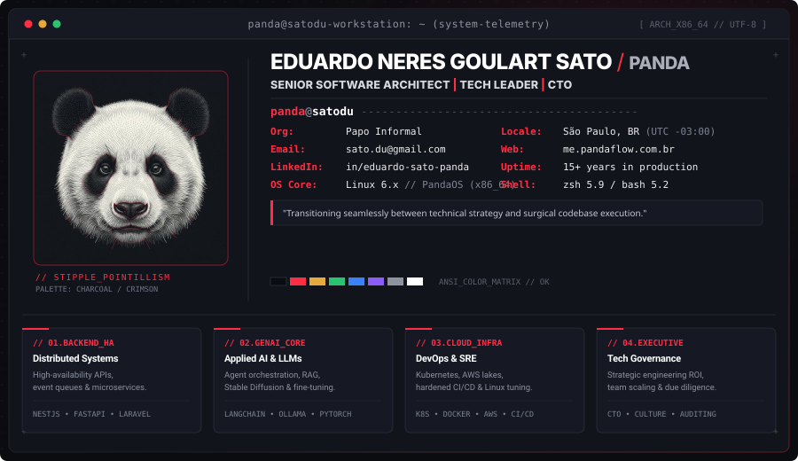

<div align="center">

<!-- UNIFIED MASTER ARCHITECTURE DASHBOARD & FASTFETCH -->


<!-- HUD QUICK CONNECT BAR -->
<p align="center">
  <a href="https://linkedin.com/in/eduardo-sato-panda">
    
  </a>
  &nbsp;
  <a href="http://me.pandaflow.com.br">
    
  </a>
  &nbsp;
  <a href="https://github.com/satodu">
    
  </a>
  &nbsp;
  <a href="mailto:sato.du@gmail.com">
    
  </a>
</p>

<!-- GITHUB STATS & TELEMETRY (TOGETHER WITH HERO) -->
<p align="center">
  
  &nbsp;
  
</p>

</div>

---

### `// 02. TECHNICAL_STACK_MATRIX`

```
[ ARCHITECTURE_SPECIFICATION: DISTRIBUTED_SYSTEMS // CLOUD_NATIVE // GENAI_RUNTIME ]
```

#### `▶ 01. Backend & Distributed Core`
> High-throughput APIs, event-driven messaging, distributed microservices, and high-availability persistence.

<p align="left">
  
</p>

#### `▶ 02. Generative AI, LLM Pipelines & Machine Intelligence`
> Local and cloud LLM orchestration, vector retrieval (RAG), custom Stable Diffusion pipelines, and agentic workflows.

<p align="left">
  
  
  
  
</p>

#### `▶ 03. Cloud Infrastructure, SRE & Data Engineering`
> Multi-cloud topologies, Kubernetes container clusters, high-volume data lakes, and CI/CD pipelines.

<p align="left">
  
</p>

#### `▶ 04. Frontend Architecture & Native Interfaces`
> Modern reactive interfaces, state orchestration, cross-platform runtimes, and desktop GUI applications.

<p align="left">
  
  
  
</p>

#### `▶ 05. Observability & Tooling`
<p align="left">
  
</p>

---

<p align="center">
  <code>+ + + [ EOF ] // PANDA.FLOW ARCHITECTURAL SYSTEM // SATO.EDUARDO + + +</code>
</p>
