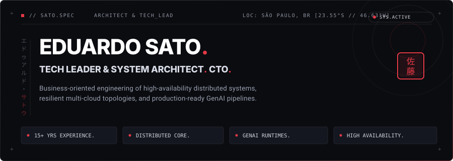
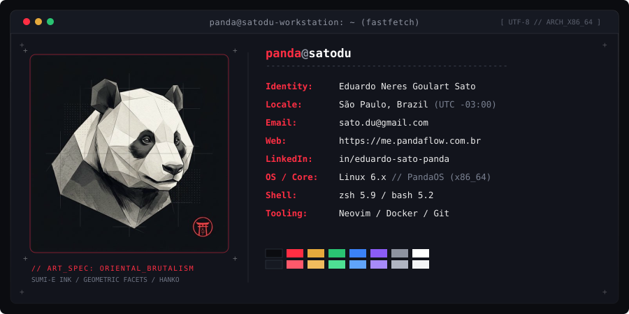
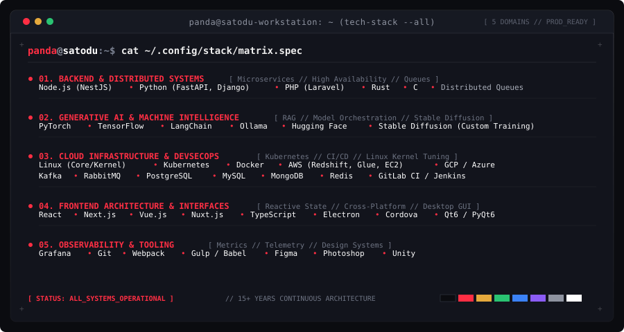

<!-- 01. HERO BANNER: IDENTITY & EXECUTIVE SUMMARY -->

<!-- HUD QUICK CONNECT BAR -->

  
  &nbsp;
  
  &nbsp;
  
  &nbsp;
  

<!-- 02. TERMINAL PROFILE: FASTFETCH WITH POINTILLISM PANDA -->

<!-- 03. TERMINAL SPECIFICATION: TECH STACK MATRIX -->

<!-- 04. SYSTEM TELEMETRY: GITHUB STATS & METRICS -->

  
  &nbsp;
  

  <code>+ + + [ EOF ] // PANDA.FLOW ARCHITECTURAL SYSTEM // SATO.EDUARDO + + +</code>

